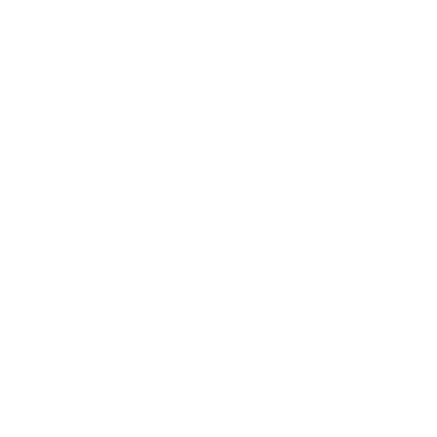

# Legacy Wheel Hub

Control panel for the Logitech Driving Force GT and G27 on Windows 10/11.
Replaces what Logitech Gaming Software used to do: rotation range, force
feedback strength, spring and damper, per-game profiles, and a LUT curve in
games that have no LUT of their own.

## Setup

Install the wheel drivers first. Nothing here ships Logitech drivers:

> https://github.com/Mysli0210/Legacy-Logitech-wheels-for-W11

Then grab `LegacyWheelHub_Setup.exe` from [Releases](../../releases). Plug the
wheel in, set what you want, hit APPLY.

SmartScreen will warn about the installer being unsigned. More info → Run anyway.

## What it does

- Rotation range, 40–900°, with presets
- Overall strength, spring, damper, centering spring, centering ramp
- Profiles per game: settings, rotation and LUT all switch when the game starts
- LUT support in games that don't have it
- Telemetry and input monitor for checking buttons, axes and pedals
- FFB test bench: push, spring, sweep, pulse, vibration
- Auto-load on connect, start with Windows, tray minimize
- EN / TR / DE, light and dark

Settings go to `%APPDATA%\Legacy Wheel Hub\settings.json`.

## LUT

Gear-driven wheels lose small forces to friction, so the wheel feels dead
around center. A LUT remaps the game's output to compensate.

Import a `.lut` in the LUT tab, tick Enable FFB post-processing, and assign
the game in the profile. Build your own curve with WheelCheck + LUT Generator,
or reuse one per profile.

Skip this in Assetto Corsa, ACC and iRacing. They already apply their own LUT
and you'd get the curve twice.

**Online games:** this drops a `dinput8.dll` next to the game executable.
Anti-cheat may not like that. Your call, your risk.

## License

GPL-3.0, because PySide6-Fluent-Widgets is. Full text in `LICENSE`, or
https://www.gnu.org/licenses/gpl-3.0.txt

## Disclaimer

Not affiliated with Logitech. "Logitech", "Driving Force" and "G27" are their
trademarks, used here to say what hardware this works with. Talks to the wheel
over USB HID and the driver's own registry settings. No Logitech code or files
are redistributed. Use at your own risk.
